# COMP9415 Review

## 2D Transformations

- **Affine transformations**

  - **Translation**
    - Translation is the process of moving an object in space
    - $\begin{pmatrix}
      q_1\\
      q_2\\
      1\end{pmatrix}=\begin{pmatrix}
      1 & 0 & \phi_1\\
      0 & 1 & \phi_2\\
      0&0&1\end{pmatrix}$
  - **Rotation**
    - Rotate objects around the origin
    - $\begin{pmatrix}
      q_1\\
      q_2\\
      1\end{pmatrix}=\begin{pmatrix}
      \cos(\theta) & -\sin(\theta) & 0\\
      \sin(\theta) & \cos(\theta) & 0\\
      0&0&1\end{pmatrix}$
  - **Scaling**
    - Scale along both axes.
    - $\begin{pmatrix}
      s_xp_1\\
      s_yp_2\\
      1\end{pmatrix}=\begin{pmatrix}
      s_x & 0 & 0\\
      0 & s_y & 0\\
      0&0&1\end{pmatrix}$
  - **Shear**
    - Shear is the unwanted child of affine transformations.
    - Horizontal
      - $\begin{pmatrix}
        q_1\\
        q_2\\
        1\end{pmatrix}=\begin{pmatrix}
        1 & h & 0\\
        0 & 1 & 0\\
        0&0&1\end{pmatrix}\begin{pmatrix}
        p_1\\
        p_2\\
        1\end{pmatrix}$
    - Vertical
      - $\begin{pmatrix}
        q_1\\
        q_2\\
        1\end{pmatrix}=\begin{pmatrix}
        1 & 0 & 0\\
        v & 1 & 0\\
        0&0&1\end{pmatrix}\begin{pmatrix}
        p_1\\
        p_2\\
        1\end{pmatrix}$

- **Transformation pipeline**

  - $P_{camera}\overset{view}{\leftarrow}P_{world}\overset{model}{\leftarrow}P_{local}$
  - The model transform transforms points in the local coordinate system to the world coordinate system
  - The view transform transforms points in the world coordinate system to the camera’s coordinate system
  - ***Matrix***
    - $P_{world}=Trans(Rot(Scale(P_{camera})))$
    - The view matrix: $P_{camera}=Scale^{-1}(Rot^{-1}(Trans^{-1}(P_{camera})))$

- **Decomposing**

  - $Translation = (\phi_1,\phi_2,1)^T$
  - $Rotation=atan2(i_2,i_1)$
  - $Scale=|i|$
  - **Perpendicular** (垂直) : $i⋅j=0$

  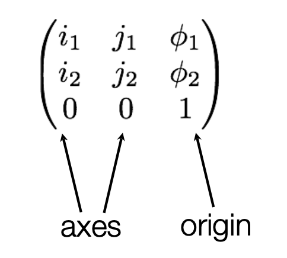

- **Camera**

  - In addition to the transformation properties inherited from SceneObject the Camera has an **aspect ratio**.

- **View matrix**

  - ```
    VIEW MATRIX: = INVERSE_CAMERA_GLOBAL_SCALE *
                   INVERSE_CAMERA_GLOBAL_ROTATION *
                   INVERSE_CAMERA_GLOBAL_TRANSLATION
    ```


## 3D Transformations

- **TransTranslation **

  - $M_T=\begin{pmatrix}
    1 & 0 & 0 & \phi_1\\
    0 & 1 & 0 & \phi_2\\
    0 & 0 & 1 & \phi_3\\
    0 & 0 & 0 & 1\end{pmatrix}$

- **Scale**

  - $M_T=\begin{pmatrix}
    S_x & 0 & 0 & 0\\
    0 & S_y & 0 & 0\\
    0 & 0 & S_z & 0\\
    0 & 0 & 0 & 1\end{pmatrix}$

- **Shear**

  - $M_T=\begin{pmatrix}
    1 & h & 0 & 0\\
    0 & 1 & 0 & 0\\
    0 & 0 & 1 & 0\\
    0 & 0 & 0 & 1\end{pmatrix}$

- **Rotate**

  - Right Hand Rule: For any axis, if the right thumb points in the positive direction of the axis the right fingers curl in the direction of rotation
  - ***Rotate X***
    - $M_x=\begin{pmatrix}
      1 & 0 & 0 & 0\\
      0 & \cos(\theta) & -\sin(\theta) & 0\\
      0 & \sin(\theta) & \cos(\theta) & 0\\
      0 & 0 & 0 & 1\end{pmatrix}$
  - ***Rotate Y***
    - $M_y=\begin{pmatrix}
      \cos(\theta) & 0 & \sin(\theta) & 0\\
      0 & 1 & 0 & 0\\
      -\sin(\theta) & 0 & \cos(\theta) & 0\\
      0 & 0 & 0 & 1\end{pmatrix}$
  - ***Rotate Z***
    - $M_z=\begin{pmatrix}
      \cos(\theta) & -\sin(\theta) & 0 & 0\\
      \sin(\theta) & \cos(\theta) & 0 & 0\\
      0 & 0 & 1 & 0\\
      0 & 0 & 0 & 1\end{pmatrix}$

- **Projection**

  - Projection happens after the model and view transformations have been applied, so all points are in camera coordinates.
  - Points with negative z values in camera coordinates are in front of the camera.
  - **Canonical View Volume (CVV)**

- **Perspective**

  - $M_{perspective}=\begin{pmatrix}
    n & 0 & 0 & 0\\
    0 & n & 0 & 0\\
    0 & 0 & a & b\\
    0 & 0 & -1 & 0\end{pmatrix}$

  - This matrix is **not affine**.

  - |       Situation       |        Matrix         |
    | :-------------------: | :-------------------: |
    | 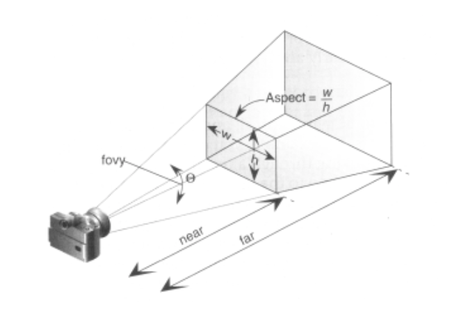 | 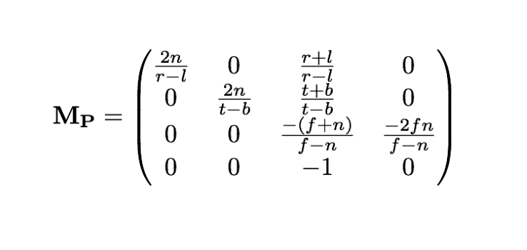 |

## Draw Algorithm 

- Painter’s algorithm
  + Sort geometric primitives by depth
  + Draw in order from back to front
  + ***Problem***
    - Intersect ploygon
- BSP Tree
  - One possible solution is to use Binary Space Partitioning trees (BSP trees)
  - They recursively divide the world into polygons that are behind or in front of other polygons and split polygons when necessary.
  - Then it is easy to traverse and draw polygons in a front to back order
  - Building the tree is slow and it needs to be rebuilt every time the geometry changes.
  - Best for rendering static geometry where tree can just be loaded in.
- Depth Buffer
  - Initially the depth buffer is initialised to 1 (maximum depth in window coords).
  - Each polygon is drawn fragment by fragment.
  - If it is closer, we update the pixel in the colour buffer and update the buffer value to the new pseudodepth. If not we discard it.
  - 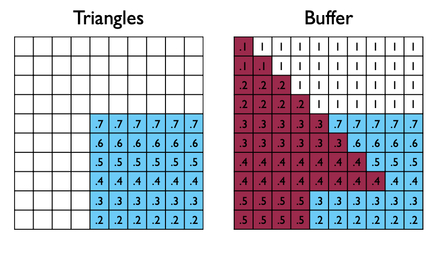

## Depth

- **Pseudodepth**
- **Bilinear interpolation**
  - Bilinear interpolation is lerping in 2 dimensions.
  - It works for any polygon.
  - $f(R_1)=\frac{y-y_1}{y_2-y_1}f(Q_2)+\frac{y_2-y}{y_2-y_1}f(Q_1)$
  - $f(R_2)=\frac{y-y_3}{y_4-y_3}f(Q_4)+\frac{y_4-y}{y_4-y_3}f(Q_3)$
  - $f(P)=\frac{x-x_1}{x_2-x_1}f(R_2)+\frac{x_2-x}{x_2-x_1}f(R_1)$
  - 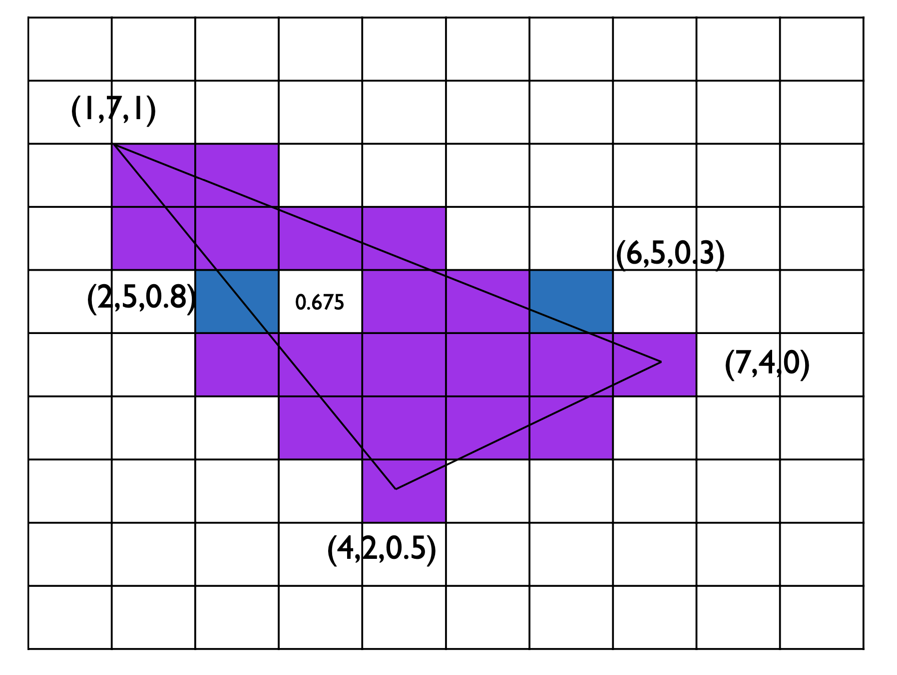
- **Z-fighting**
  - The depth buffer has limited precision
  - To prevent this, you can offset one of the two polygons using **glPolygonOffset()**.

## Clipping

- **Cohen-Sutherland (line vs rect)**

  - Clipping lines to an axis-aligned rectangle.

  - ```c
    code = 0;
    if (x < left) code |= 8; 
    if (y > top) code |= 4; 
    if (x > right) code |= 2;
    if (y < bottom) code |= 1;
    return code;
    ```

  - |       Labelling       |   Clipping a point    |
    | :-------------------: | :-------------------: |
    | 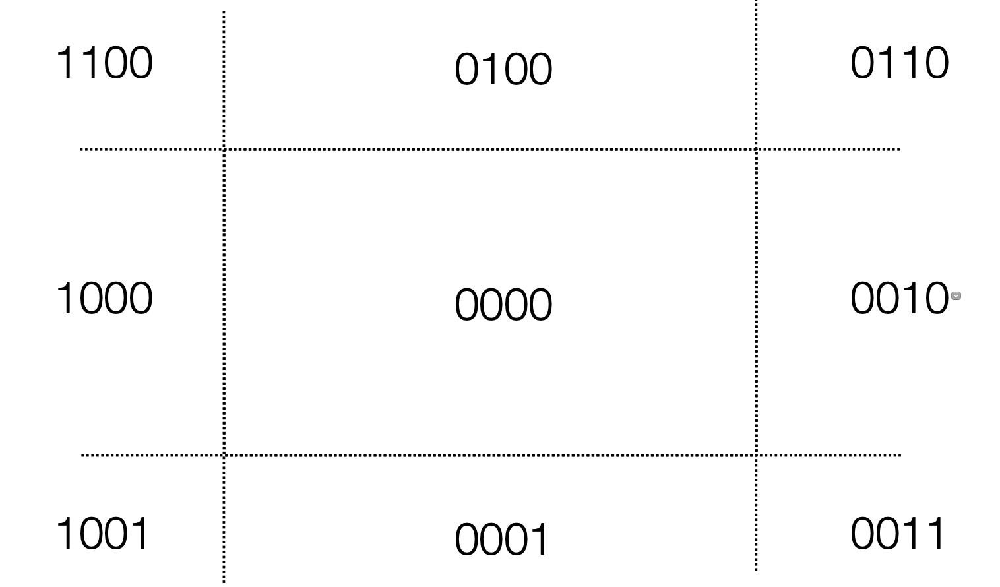 | 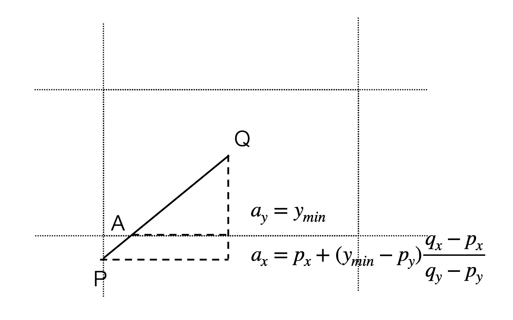 |

    No bit in common,  need to clip.

  - 

- Cyrus-Beck (line vs convex poly)**

  - Clipping a line to a convex polygon.
  - Parametric ray:
    - $R(t)=A+ct$
  - Point normal segment:
    - $n\cdot(P-B)=0$
  - Collide when:
    - $n\cdot(R(t_{hit})-B)=0$
  - ***Hit time***
    - $n\cdot(R(t_{hit})-B)=0$
    - $n\cdot(A+(ct_{hit})-B)=0$
    - $n\cdot(A-B)+n\cdot ct_{hit}=0$
    - $t_{hit}=\frac{n\cdot(B-A)}{n\cdot c}$
    - $P_hit = A+ct_{hit}$
    - 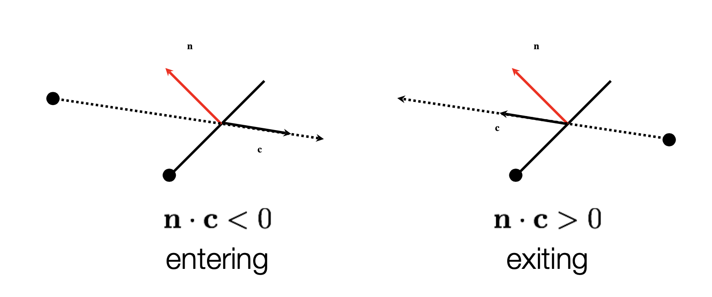
  - Initialise tin to 0 and tout to 1
  - Compare the ray to each edge of the (convex) polygon.
  - Compute thit for each edge.
  - Keep track of maximum tin
  - Keep track of minimum tout.
  - 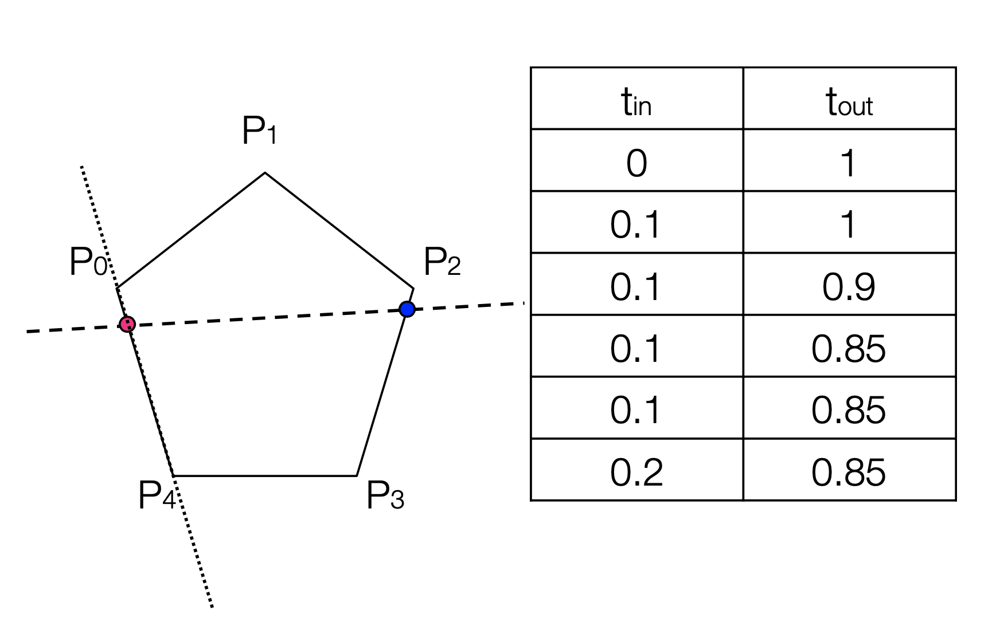

- **Sutherland-Hodgman (poly vs convex poly)**

- **Weiler-Atherton (ploy vs poly)**

  

## Limitations

- **$\widehat{s}$** is the vector from vectex to light source

- **$\widehat{m}$** is the vector of model

- **$\widehat{v}$** is the vector from vectex to camera

- **$\widehat{r}$** is the vector of reflereflection ($\widehat{m}$ 做法线)

- ***All vector should be normalisation***

- **Ambient light** （环境光）

  - $I_{ambient}=I_{a}\rho_a$

    - $I_a$ is the ambient light intensity 


    - $ρ_a$ is the ambient reflection coefficient 


      in the range (0,1) (usually $ρ_a$ = $ρ_d$)

  - Lighting with just diffuse and specular lights gives very stark shadows.

  - In reality shadows are not completely black.

  - It is too computationally expensive to model this in detail.

  - Light is coming from all directions, reflected off other objects, not just from ‘sources’

- **Diffuse light (Lambert’s Cosine Law)** （扩散光）

  - $I_d = I_s\rho_d(\widehat{s}\cdot\widehat{m})$
    - $I_s$ is the source intensity
    - $\rho_d$ is the diffuse reflection coefficient in [0,1]
  - Both vectors are normalised
  - When the angle is 0 degrees the cosine is 1
    - All the reflected light back
  - When the angle is 90 degrees
    - None of the light is reflected back
  - When the angle is > 90 degrees
    - $cos$ gives us a negative value! This is not what we want.

- **Specular light (Phong model)** (高光)

  - $\widehat{r}=-s+2(s\cdot\widehat{m})\widehat{m}$

  - $I_{sp}=max(0, I_s\rho_{sp}(\widehat{r}\cdot\widehat{v})^{f})$
    - $ρ_{sp}$ is the specular reflection coefficient in the range [0,1]
    - $f$ is the phong exponent, typically in the range [1,128]
    - Larger values of the Phong exponent *f* make cos(Φ)*f* smaller, produce less scattering, creating more mirror-like surfaces.

- **Blinn Phong Model**

  - $I_{sp}=max(0, I_s\rho_{sp}(\widehat{h}\cdot\widehat{m})^{f})$
  - halfway vector $\widehat{h} = \frac{\widehat{s} + \widehat{v}}{2}$
  - Phong/Blinn Phong model only reflects light sources, not the environment.
  - It is good for adding bright highlights but cannot create a true mirror.

- **Total intensity for the vertex**
  - $I=I_{ambient} + I_{diffuse} + I_{specular}$
  - $I=I_{a}ρ_a + max(0, I_sρ_d(\widehat{r}\cdot\widehat{v})) + max(0, I_s\rho_{sp}(\widehat{r}\cdot\widehat{v})^{f})$
  
- **Spotlights**
  - A spotlight has a direction and a cutoff angle
  - Spotlights are also attenuated, so the brightness falls off as you move away from the centre.
  - $I=I_s(cos(\beta))^{\varepsilon}$
    - ε is the attenuation factor 

## Shading

- **Flat shading** 
  
  - ***Compute the intensity for some point on the face (usually the first vertex)***
  - ***Set every pixel to that value.***
  
  - Calculated for each face
  - The simplest option is to shade the entire face the same colour
  - ***Pro***
    - Diffuse illumination
    - For flat surfaces with distant light sources
    - Non-realistic/retro rendering
    - The fastest shading option
  - ***Con***
    - close light sources
    - specular shading
    - curved surfaces
  
- **Gouraud shading** 
  - Calculated for each vertex and interpolated for every fragment
  
  - Illumination
 is calculated at each of these vertices.
  
  - Gouraud shading is a simple smooth shading model.
  
  - We calculate fragment colours by bilinear interpolation on neighbouring vertices.
  
  - ***Pro***
    - curved surfaces
    - close light sources
  - diffuse shading
    
  - ***con***
    - more expensive than flat shading
    - handles specular highlights poorly
    
  - ***Example***
  
    
  
    $I_d(Q_1)=\widehat{s_1}\cdot\widehat{m_1}=\cos(30^{\circ})$
  
    $I_d(Q_1)=\widehat{s_2}\cdot\widehat{m_2}=\cos(75^{\circ})$
  
    $I_s(Q_1)=max(0,(\widehat{r_1}\cdot\widehat{m_1}))=max(0, \cos(105^{\circ}))= 0$
  
    $I_s(Q_2)=max(0,(\widehat{r_2}\cdot\widehat{m_2}))=max(0, \cos(105^{\circ}))= 0$
  
    - ***Flat Shading***
      - $I_d(P)=I_d(Q_1) | I_d(Q_2)$
  
    
  
    

- **Phong shading**
  
  - Calculated for every fragment
  
  - designed to handle specular lighting better than Gouraud. 
  
  - It also handles diffuse better as well.
  
  - illumination values are calculated per fragment rather than per vertex
  
  - ***Pro***
    - Handles specular lighting well
    - Improves diffuse shading
    - More physically accurate
    
  - ***Con***
    
    - Slower than Gouraud as normals and illumination values have to be calculated per pixel rather than per vertex. 
    - In the old days this was a BIG issue. Not so much any more.
    
  - |         Phong         |       Actually        |
    | :-------------------: | :-------------------: |
    | 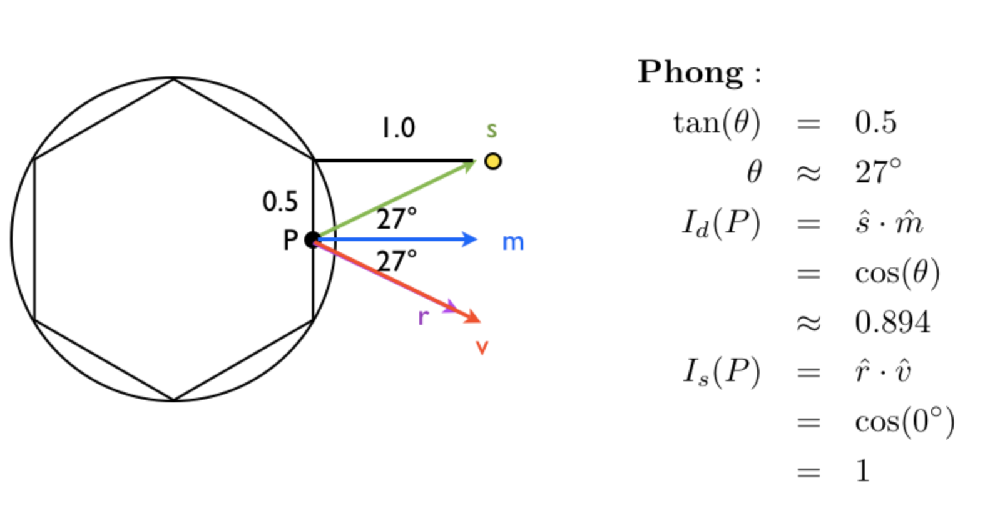 | 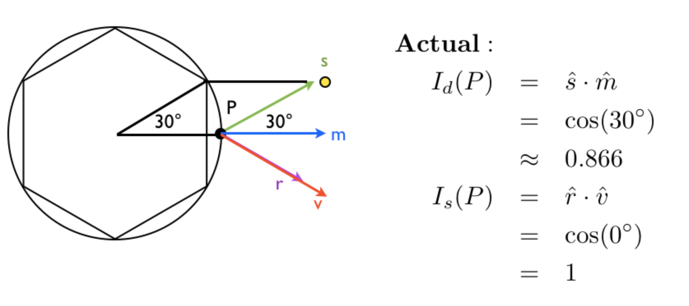 |

|         | Where    | Pro                                | Con                                  |
| ------- | -------- | ---------------------------------- | ------------------------------------ |
| Flat    | Face     | Flat surfaces, a retro blocky look | Curved surfaces, specular highlights |
| Gouraud | Vertex   | Curved surfaces, diffuse shading   | Specular highlights                  |
| Phong   | Fragment | Diffuse and specular shading       | Old hardware                         |

## Color

- **Alpha blending**

  - $\begin{pmatrix}
    r\\
    g\\
    b
    \end{pmatrix} \leftarrow  a\begin{pmatrix}
    r_{image}\\
    g_{image}\\
    b_{image}
    \end{pmatrix} + (1-a)\begin{pmatrix}
    r\\
    g\\
    b
    \end{pmatrix}$

  - ***Example:*** 

    - If the pixel on the screen is currently green, and we draw over it with a red pixel, 
with alpha = 0.25

    - $p=\begin{pmatrix}
      0\\
      1\\
      0\\
      1\end{pmatrix}$ $p_{image}=\begin{pmatrix}
      1\\
      0\\
      0\\
      0.25\end{pmatrix}$

    - $p=0.25\begin{pmatrix}
      1\\
      0\\
      0\\
      0.25\end{pmatrix} + 0.75\begin{pmatrix}
      0\\
      1\\
      0\\
      1\end{pmatrix} = \begin{pmatrix}
      0.25\\
      0.75\\
      0\\
      0.8125\end{pmatrix}$

      

  - **Con**

    - Alpha blending depends on the order that pixels are drawn.
    - You need to draw transparent polygons after the polygons behind them.
    - Must be Back-to-front order

##Curves

- **de Casteljau Algorithm**（Bézier curves ）
  - Linear interpolation
    - $P(t)=(1-t)P_0+tP_1$
  - Quadratic interpolation
    - $P(t)=(1-t)^2P_0+2t(1-t)P_1+t^2P_2$
  - Cubic interpolation
    - $P(t)=(1-t)^3P_0+3t(1-t)^2P_1+3t^2(1-t)P_2+t^3P_3$
- **Bézier curves**
  - $\sum_{k=0}^{m}{B_k^{m}(t)P_k}$
    - ***m*** is the degree of the curve 

    - ***$P_0$...$P_m$*** are the control points
  - The coefficient functions are called Bernstein polynomials.
    - $B_k^{m}(t)=\begin{pmatrix}
      m\\
      k
      \end{pmatrix}t^k(1-t)^{m-k}$
    - $\begin{pmatrix}
      m\\
      k
      \end{pmatrix}=\frac{m!}{k!(m-k)!}$ is binomial function
  - ***example***
    - m = 3
    - $B_0^{3}(t)=(1-t)^3$
    - $B_1^{3}(t)=3t(1-t)^2$
    - $B_2^{3}(t)=3t^2(1-t)$
    - $B_3^{3}(t)=t^3$
    - $P(t)=(1-t)^3P_0+3t(1-t)^2P_1+3t^2(1-t)P_2+t^3P_3$
- **Tangents**
  - Tangent vector
    - $\frac{dP(t)}{dt}=\sum_{k=0}^m\frac{dB_{k}^m(t)}{dt}P_k$
    
    - $\frac{dP(t)}{dt}=m\sum_{k=0}^{m-1}\frac{dB_{k}^{m-1}(t)}{dt}(P_{k+1}-P_k)$
    
    - ***Example***
    
      -  t = 0.25
    
      - 
      - $P_{01} = (4, 16) - (0,0) = (4,16)$
      - $P_{12} = (20, 8) - (4,16) = (16,-8)$
      - $P_{23} = (20, 0) - (20,8) = (0,-8)$
      - $tangent = 3*[(1-t)^2P_{01}+2t(1-t)P_{12}+t^2P_{23}]$
      - $= 3*[(1-0.25)^2*(4,16)+2*0.25*(1-0.25)(16,-8)+0.25^2*(0,-8)]$
      - $=(24.75, 16.5)$ 
- **L-System **(Lindenmayer System)
  
  - Can give us realistic plants and trees
  - L-system is a formal grammar
  - Symbols
    - A, B, +, -
    - A→B - A - B
    - B→A + B + A
  - Use a **LIFO** stack to save and restore global state like position and heading

##Textures

- Usage

  - 1. Load or creating textures
    2. Passing the texture to a shader
    3. Mapping texture co-ordinates to vertices

- Texture WRAP

  - GL.GL_REPEAT (default)
  - GL.GL_MIRRORED_REPEAT 
  - GL.GL_CLAMP_TO_EDGE

  - ```c
    gl.glTexParameteri( GL.GL_TEXTURE_2D, GL.GL_TEXTURE_WRAP_S, GL.GL_REPEAT);
    gl.glTexParameteri( GL.GL_TEXTURE_2D, GL.GL_TEXTURE_WRAP_T, GL.GL_REPEAT);
    ```

- **Textures and shading**

  - The simplest approach is to replace illumination calculations with a texture look-up.

    - $I(P)=T(s(P),t(P))$
    - This produces objects which are not affected by lights or color.
  - A more common solution is to use the texture to modulate the ambient and diffuse reflection coefficients.
    - $I(P)=T(s,t)[I_a\rho_a+I_d\rho_d(\widehat{s}\cdot\widehat{m})]+I_s\rho_s(\widehat{r}\cdot\widehat{v})^f$
    - We usually leave the specular term unaffected because it is unusual for the material colour to affect specular reflections.

- **Magnification**（zoom in）

  - Nearest Texel
    - Find the nearest texel
    
    - ```c
      gl.glTexParameteri(GL.GL_TEXTURE_2D, GL.GL_TEXTURE_MAG_FILTER, GL.GL_NEAREST);
      ```
    
    - 
    
  - Bilinear Filtering
    
    - Find the nearest four texels and use bilinear interpolation over them 
    
    - ```c
      gl.glTexParameteri(GL.GL_TEXTURE_2D, GL.GL_TEXTURE_MAG_FILTER, GL.GL_LINEAR);
      ```
    
    - 
    
  - |        Nearest        |       Bilinear        |
    | :-------------------: | :-------------------: |
    | 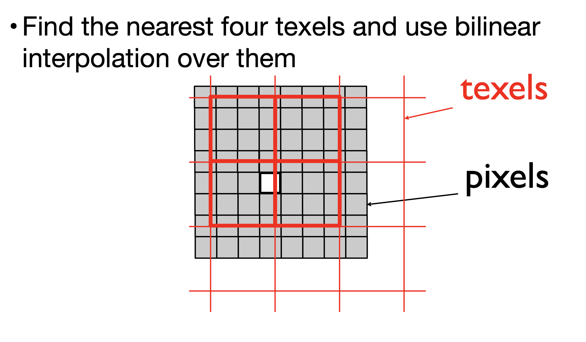 | 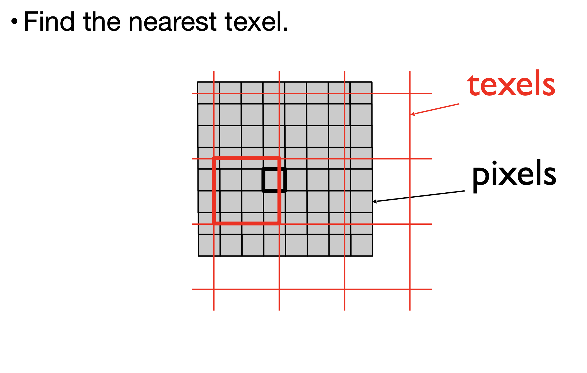 |

    

- **Minification** (zoom out)

  - ***Aliasing***
    - It occurs when samples are taken from an image at a lower resolution than repeating detail in the image.
  - ***Filtering***
    - One screen pixel overlaps multiple texels but is taking its value from only one of those texels.
    - A better approach is to average the texels that contribute to that pixel.
    - Doing this on the fly is expensive.

- **MIP mapping**

  - Starting with a 512x512 texture we compute and store 256x256, 128x128, 64x64, 32x32, 16x16, 8x8, 4x4, 2x2 and 1x1 versions.

  - This takes total
 memory = 4/3 original.

  - ```
    gl.glGenerateMipmap(GL.GL_TEXTURE_2D);
    ```

  - The simplest approach is to use the next smallest mipmap for the required resolution.

- **Trilinear filtering**

  - A more costly approach is trilinear filtering
    - Use bilinear filtering to compute pixel values based on the next highest and the next lowest mipmap resolutions.
    - Interpolate between these values depending on the desired resolution.

- **Aniso Filtering**

  - If a polygon is on an oblique angle away from the camera, then minification may occur much more strongly in one dimension than the other.
  - Anisotropic filtering is filtering which treats the two axes independently.

- **RIP Mapping**

  - RIP mapping is an extension of MIP mapping which down-samples each axis and is a better approach to anisotropic filtering
    - 256x256 image has copies at:
256x128, 256x64, 256x32, 256x16, ..., 
 128x256, 128x128, 128x64, ....
 64x256, 64x128, etc.
  - ***Con***
    - Does not handle diagonal anisotropy.
    - More memory required for RIP maps (4 times as much).
    - Not implemented in OpenGL

- **Multi-texturing**

  - Have to pass two different textures to the shader.
  - two different sets of texture coordinates

- **Animated textures**

  - Animated textures can be achieved by loading multiple textures and using a different one on each frame.

- **Rendering to a texture**

  - A common trick is to set up a camera in a scene, render the scene into an offscreen buffer, then copy the image into a texture to use as part of another scene.

- **Reflection mapping (cube mapping)** 

  - Doing this in general is expensive, but we can make a reasonable approximation with textures
    - Generate a cube that encloses the reflective object.
    - Place a camera at the centre of the cube and render the outside world onto the faces of the cube.
    - Use this image to texture the object
  - To apply the reflection-mapped texture to the object we need to calculate appropriate texture coordinates.
  - We do this by tracing a ray from the camera, reflecting it off the object and then calculating where it intersects the cube.
  - ***Pros***
    - Produces reasonably convincing polished metal surfaces and mirrors
  - ***Cons***
    - Expensive: Requires 6 additional render passes per object
    - Angles to near objects are wrong.
    - Does not handle self-reflections or recursive reflections.

- **Shadow buffering**

  - keep a shadow buffer for each light source.

  - The shadow buffer is like the depth buffer, it records the distance from the light source to the closest object in each direction.

    - Render the scene from each light's viewpoint capturing only z-info in shadow (depth) buffer (color buffer turned off)
    - Render the scene from camera’s point of view, using the previously captured shadow buffers to modulate the fragments

  - When rendering a point P

    - Project the point into the light's clip space.

    - Calculate the index (i,j) for P in the shadow buffer

    - Calculate the pseudodepth d relative to the light source

    - If shadow[i,j] < d then P is in the shadow

  - ***Pro***

    - Provides realistic shadows
    - No knowledge or processing of the scene geometry is required

  - ***Cons***

    - More computation

    - Shadow quality is limited by precision of shadow buffer. This may cause some aliasing artefacts.

    - Shadow edges are hard.

    - The scene geometry must be rendered once per light in order to generate the shadow map for a spotlight, and more times for an omnidirectional point light.

- **Light Mapping**

  - If our light sources and large portions of the geometry are static then we can precompute the lighting equations and store the results in textures called light maps.

  - This process is known as baked lighting.

  - ***Pro***

    - Sophisticated lighting effects can be computed at compile time, where speed is less of an issue.

  - ***Con***

    - Memory and loading times for many individual light maps.

    - Not suitable for dynamic lights or moving objects.

    - Potential aliasing effects depending on the resolution of the light maps.

- **Normal mapping**

  - Phong shader we are assuming that the surface of the polygon is smoothly curved.
  - One solution would be to increase the number of polygons to represent all the deformities, but this is computationally unfeasible for most applications.
  - Instead we use textures called normal maps to simulate minor perturbations in the surface normal.
  - Rather than arrays of colours, normal maps can be considered as arrays of ***vectors***. These vectors are added to the interpolated normals to give the appearance of roughness.
  - ***Pro***
    - Provide the illusion of surface texture
  - ***Cons***
    - Does not affect silhouette
    - Does not affect occlusion calculation


### Rasterisation

- Rasterisation is the process of converting lines and polygons represented by their vertices into fragments.

- Fragments are like pixels but include color, depth, texture coordinate. They may also never make it to the screen due to hidden surface removal or culling.

- This operation needs to be accurate and efficient.

  ---

- **Bresenham's algorithm**

  - The key idea is that calculations are doneincrementally, based on the values for the previous pixel.
  - assume to begin with that the line is in the first octant.
  - For each x we work out which pixel we set next
    - The next pixel with the same y value if the line passes below the midpoint between the two pixels
    - Or the next pixel with an increased y value if the line passes above the midpoint between the two pixels

  ```c
  int y = y0;
  for (int x = x0; x <= x1; x++) {
      setPixel(x,y);
      M = (x + 1, y + 1/2)
      if (M is below the line)
  				y++ 
  }
  ```

  ```c
  int y = y0;
  int w = x1 - x0; 
  int h = y1 - y0;
  int F = 2 * h - w;
  
  for (int x = x0; x <= x1; x++) {
    drawPixel(x,y);
  	if (F < 0) 
      F += 2*h;
  	else {
  		F += 2*(h-w); y++;
    }
  }
  ```

  - Example 

    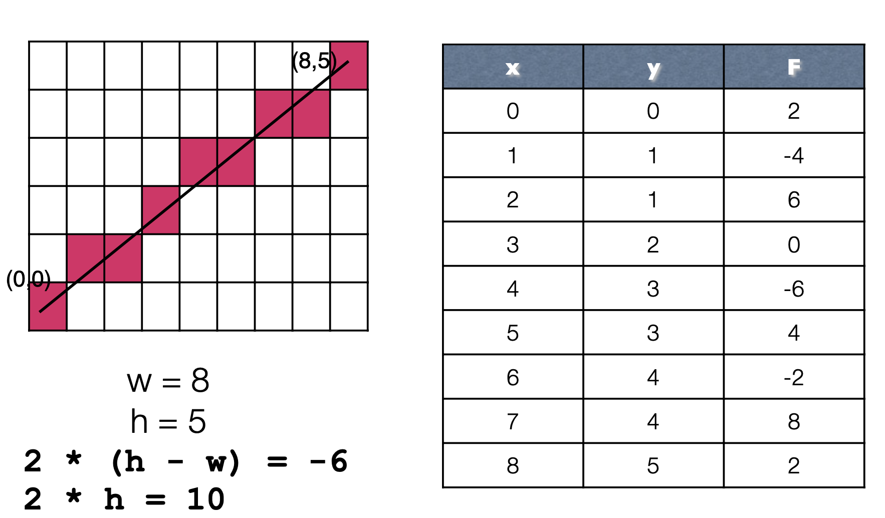

- **Polygon filling**

  - Shared edges
    - We adopt a rule: The edge pixels belong to the rightmost and/ or upper polygon; i.e. do not draw rightmost or uppermost edge pixels

- **Scanline algorithm**

  - Testing every pixel is very inefficient.

  - We only need to check where the result changes value, i.e. when we cross an edge

  - We proceed row by row:

    - Calculate intersections incrementally.
    - Sort by x value.
    - Fill runs of pixels between intersections.

  - ***Edge table***

    - The edge table is a lookup table indexed on the y-value of the lower vertex of the edge.

    - Horizontal edges are not added

    - We store the the x-value of the lower vertex, the increment (inverse gradient) of the edge and the y-value of the upper vertex.

      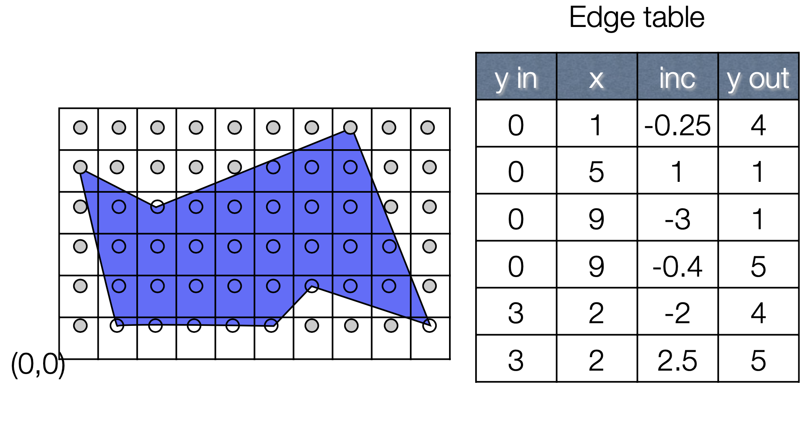

  - ***Active Edge List***

    - On the left edge, round up to the nearest integer, with round(n) = n if n is an integer.
    - On the right edge, round down to the nearest integer, but with round(n) = n-1 if n is an integer.

    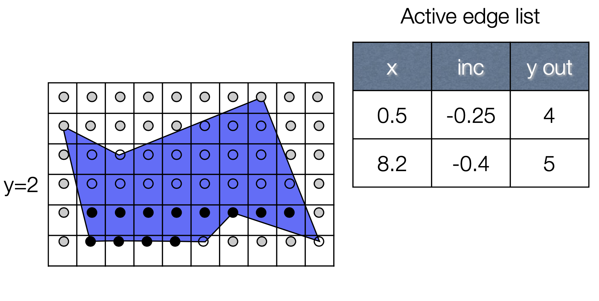

- **Antialiasing**

  - ***Prefiltering***

    - Prefiltering is computing exact pixel values geometrically rather than by sampling.

      |        Input        |       Result        |
      | :-----------------: | :-----------------: |
      | 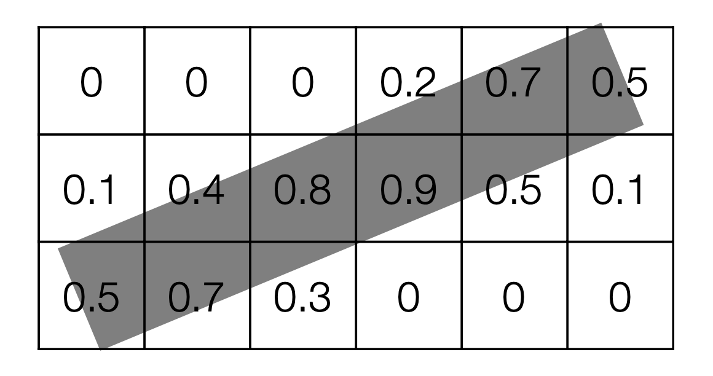 | 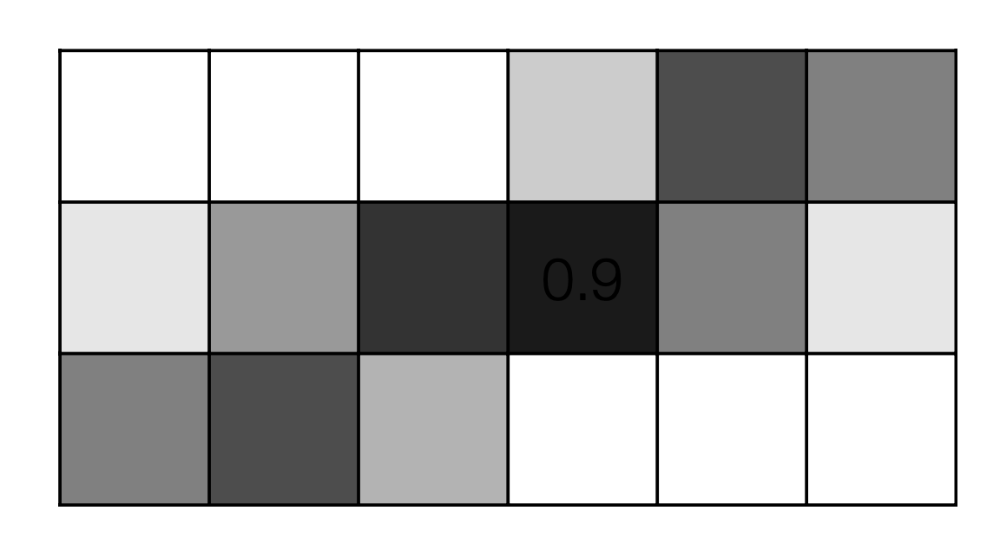 |

    - ***Prefiltering is most accurate but requires more computation.***

  - ***Postfiltering***

    - ***Postfiltering can be faster. Accuracy depends on how many samples are taken per pixel. More samples means larger memory usage.***

    - Postfiltering is taking samples at a higher resolution (supersampling) and then averaging.
    - Draw the line at a higher resolution and average (supersampling).

    |  Higher resolution  |       Sample        |       Output        |
    | :-----------------: | :-----------------: | :-----------------: |
    | 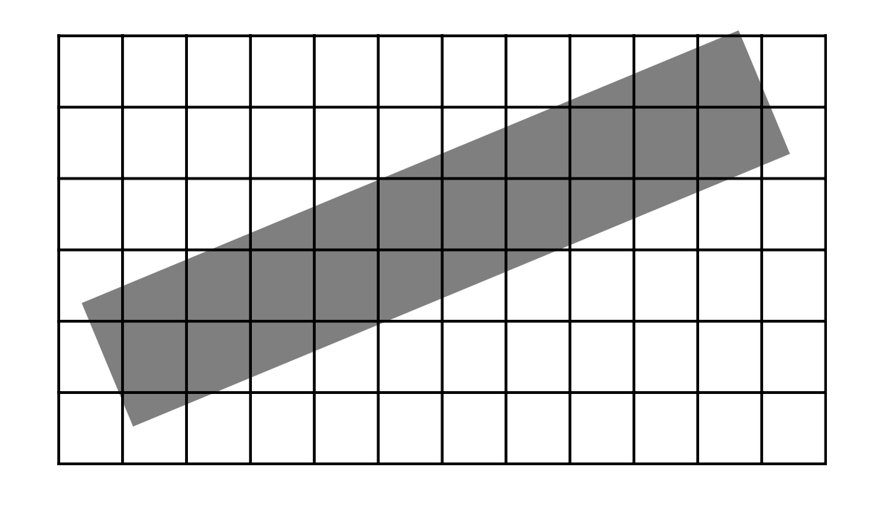 | 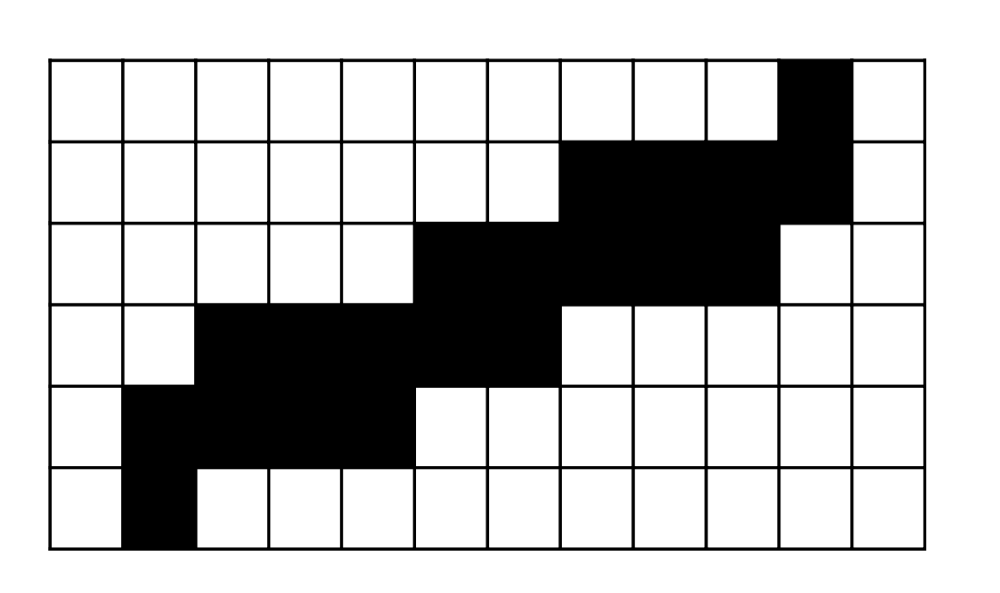 | 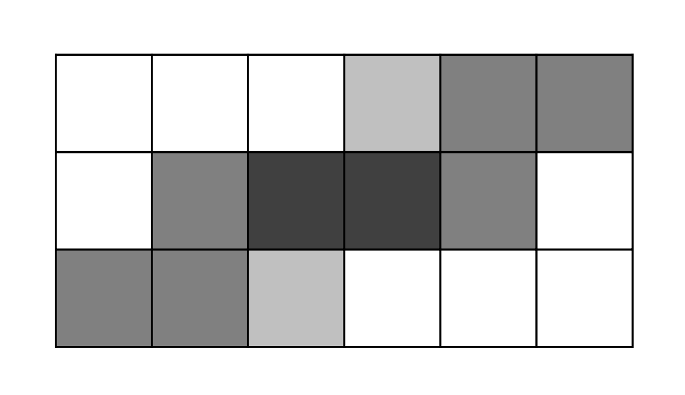 |

  - ***Weighted postfiltering***

    - It is common to apply weights to the samples to favour values in the center of the pixel.

  - ***Stochastic sampling*** (Random)

    - Taking supersamples in a grid still tends to produce noticeably regular aliasing effects.
    - Adding small amounts of jitter to the sampled points makes aliasing effects
appear as visual noise.

  - ***Adaptive Sampling***

    - Supersampling in large areas of uniform colour is wasteful.
    - Supersampling is most useful in areas of major colour change.
    - Solution: Sample recursively, at finer levels of detail in areas with more colour variance.

    |        Input        |        Output        |
    | :-----------------: | :------------------: |
    | 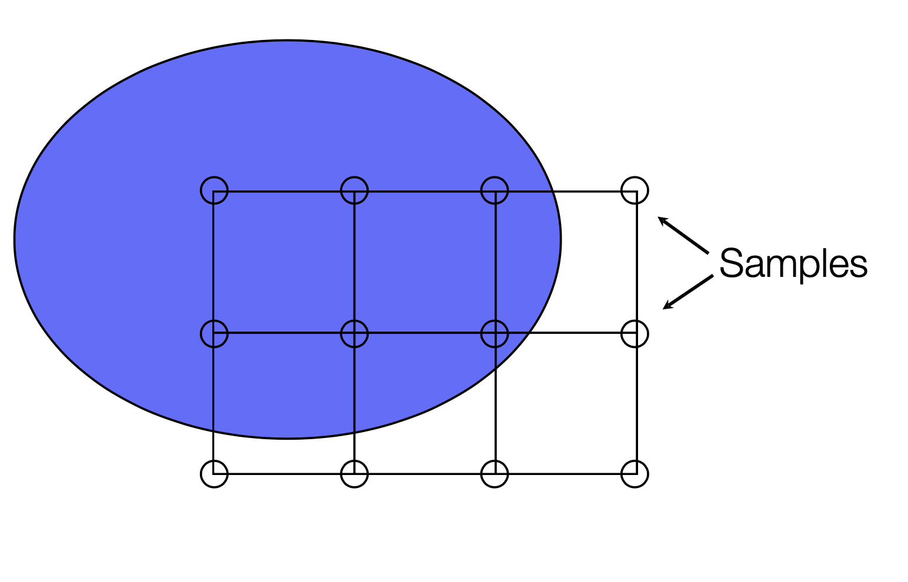 | 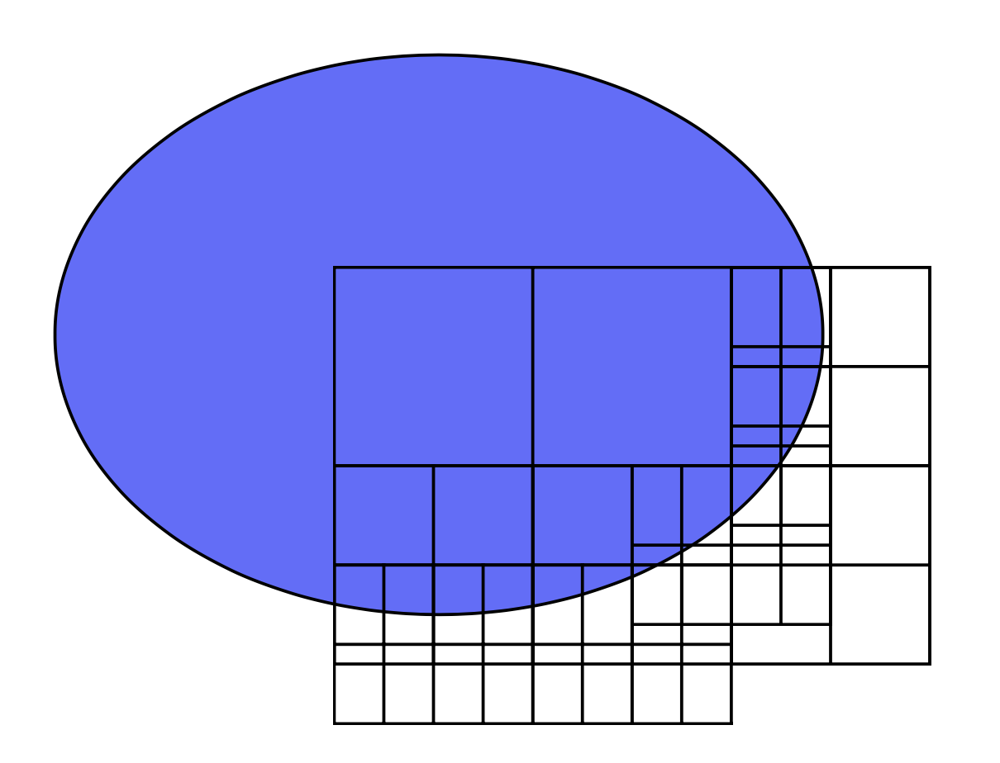 |

## Particle systems (粒子系统)

- Some visual phenomena are best modelled as collections of small particles.

- Particles are usually represented as small textured quads or point sprites – single vertices with an image attached.

- They are billboarded, i.e transformed so that they are always face towards the camera.

- Particles are created by an emitter object and evolve over time, usually changing position, size, colour.

  

## Global Lighting

- The lighting equation we looked at earlier only handled direct lighting from sources:
  - $I=I_a\rho_a+\sum_{l\varepsilon lights}I_l(\rho_d(\widehat{S_1}\cdot\widehat{m})+\rho_{sp}(\widehat{r_1}\cdot\widehat{v})^{f})$
  - We added an ambient fudge term to account for all other light in the scene.
  - Without this term, surfaces not facing a light source are black.
  - Methods that take this kind of multi-bounce lighting into account are called global lighting methods.

## Raytracing (Global lighting)

- Raytracing models specular reflection and refraction.

- Both methods are computationally expensive and are rarely suitable for real-time rendering.

- Ray tracing is a different approach to rendering than the pipeline we have seen so far.

- **Projective Methods vs RayTracing**

  - ***Projective Method***

    - For each **object:**
 Find and update each pixel it influences

  - ***Ray Tracing***

    - For each **pixel:**
Find each object that influences it and update accordingly

  - Same

    - shading models
    - calculation of intersections,

  - Difference

    - projection and hidden surface removal come for ‘free’ in ray tracing

  - |      Projective       |        Ray Tracing        |
    | :-------------------: | :-----------------------: |
    | 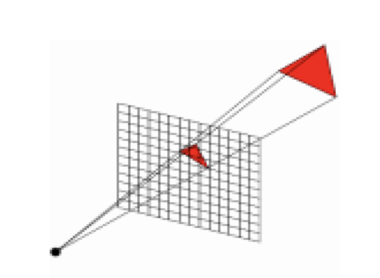 | 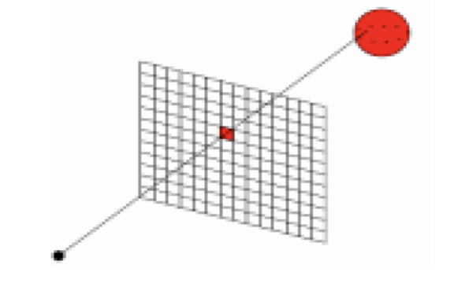Same |

- Location of pixel

  - 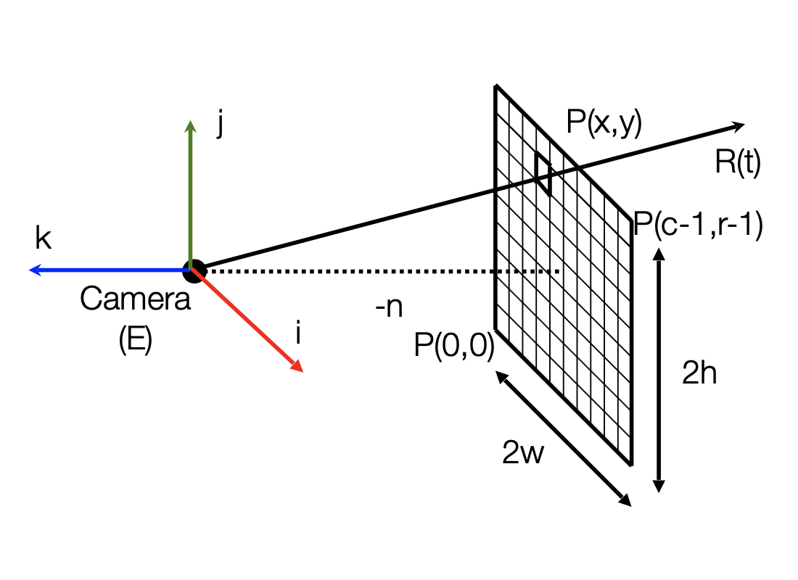
  - $pixelWidth=\frac{2w}{c}$
  - $pixelHeight=\frac{2h}{r}$
  - $i_c=-w+x(\frac{2w}{c})=w(\frac{2x}{c}-1)$
  - $j_r=h(\frac{2y}{r}-1)$
  - The point P(x,y) of pixel (x,y) is given by:
    
    - $P(x,y)=E+w(\frac{2x}{c}-1)i+h(\frac{2y}{r}-1)k-nk$
  - A ray from the camera through P(x,y) is given by:
    - $R(t)=E+t(P(x,y)-E)=E+tv$
    - $v = w(\frac{2x}{c}-1)i+h(\frac{2y}{r}-1)k-nk$
    - t = 0, we get E (Eye/Camera)
    - t = 1, we get P(x,y) – the point on the near plane
    - t > 1 point in the world
  - t < 0 point behind the camera – not on ray
  
- ***Generic Sphere***
  
  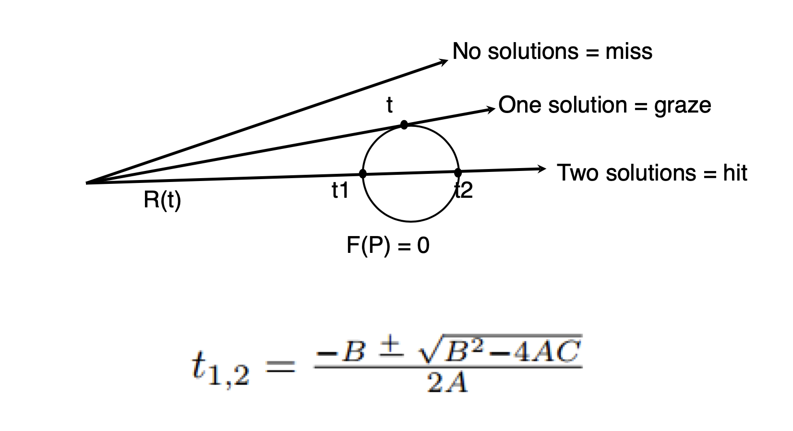
  
- ***Shadows***
  
  - At each hit point we cast a new ray towards each light source. These rays are called shadow feelers.
  
- ***Extents*** (大小)
  
    - Extents are bounding boxes or spheres which enclose an object
    - To compute a box extent for a mesh we simply take the min and max x, y and z coordinates over all the points.
    - To compute a sphere extent we find the centroid of all the vertices by averaging their coordinates. This is the centre of the sphere.
  - 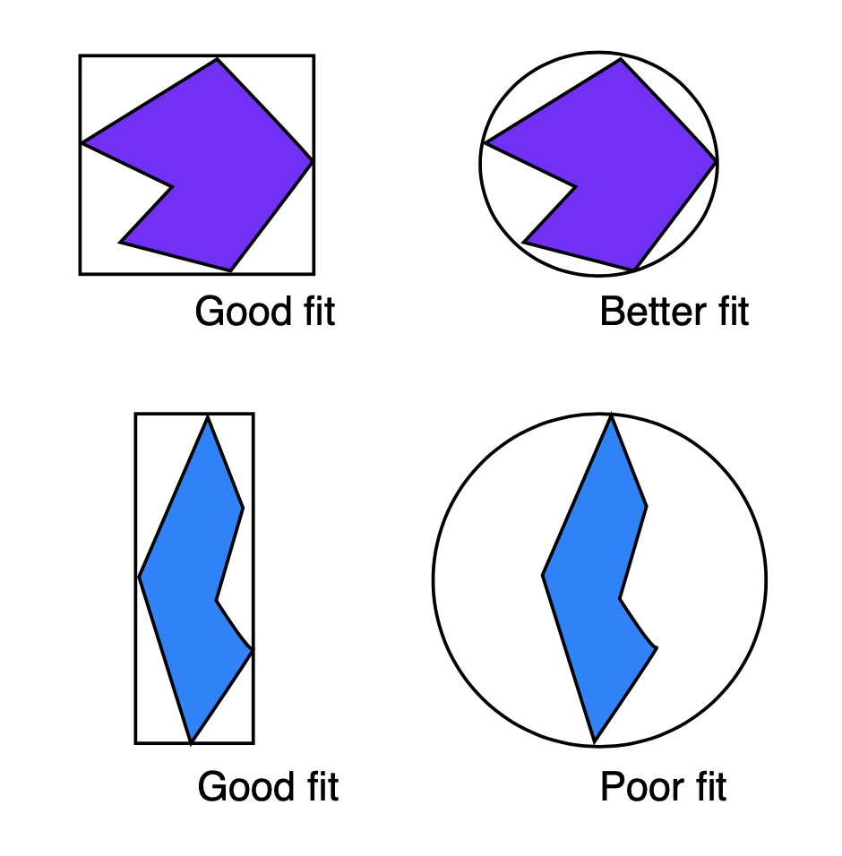
  
- ***Projection extents***
  
  - A projection extent of an object is a bounding box which encloses all the pixels which would be in the image of the object (ignoring occlusions).
  
- ***Binary Space Partitioning (BSP)***
  
    - Another approach to optimisation is to build a Binary Space Partitioning (BSP) tree dividing the world into cells, where each cell contains a small number of objects.
  - 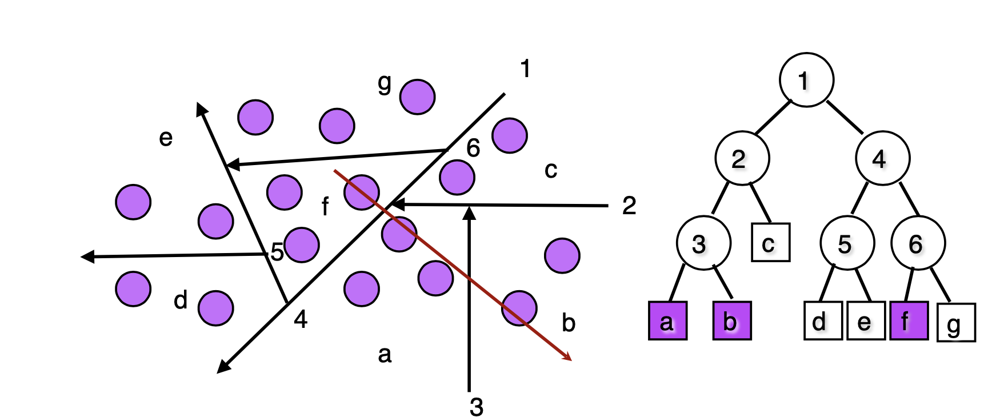
  
- **Raytracing Can’t Do**
  
    - Basic recursive raytracing cannot do:
      - Light bouncing off a shiny surface like a mirror and illuminating a diffuse surface
      - Light bouncing off one diffuse surface to illuminate others
      - Light transmitting then diffusing internally
    - Also a problem for rough specular reflection
    - Fuzzy reflections in rough shiny objects
  
- **Realtime ray-tracing (RTX)**
  
    - Works by arranging objects in a bounding volume hierarchy (BVH)
    - Specialised hardware offers fast traversal of these hierarchies to find ray intersections.


## Radiosity (Global lighting)

- Radiosity models diffuse reflection
- Radiosity is a global illumination technique which performs indirect diffuse lighting.
- Direct lighting techniques only take into account light coming directly from a source.
- Raytracing takes into account specular reflections of other objects.
- Radiosity takes into account diffuse reflections of everything else in the scene.
- **Finite elements**
  - We divide the scene up into small patches.
  - We then calculate the 
 energy transfer from each 
 patch to every other patch.
  - ***Energy transfer***
    - The basic equation for energy transfer is:
    - Light output = Light emitted + ρ * Light input
    - Where ρ is the diffuse reflection coefficient.  
    - $B_i=E_i+\rho_i\sum_jB_jF_{ij}$
      - $B_i$ is the radiosity of patch i

      - $E_i$ is the energy emitted by patch i

      - $\rho_i$ is the reflectivity of patch i

      - $F_{ij}$is a form factor which encodes what fraction of light from patch j reaches patch i.

## Color

- **RGB**
  - Red, Green, Blue
  - Colour is expressed as the addition of red, green and blue components.
- **CMYK**
  - Cyan, Magenta,Yellow, Black
  - CMY is a subtractive colour model, typically used in describing printed media.
- **HSV**
  - Hue, Saturation,Value (Brightness)
  - HSV (aka HSB) is an attempt to describe colours in terms that have more perceptual meaning
  - H represents the hue as an angle
from 0° (red) to 360° (red)
  - S represents the saturation
 from 0 (grey) to 1 (full colour)
  - V represents the value/brightness
form 0 (black) to 1 (bright colour).
- **HSL**
  - Hue, Saturation, Lightness
  - HSL (aka HLS) replaces the brightness parameter with a (perhaps) more intuitive lightness value.
  - H represents the hue as an angle
from 0° (red) to 360° (red)
  - S represents the saturation
 from 0 (grey) to 1 (full colour)
  - L represents the lightness form 0 (black) to 1 (white).